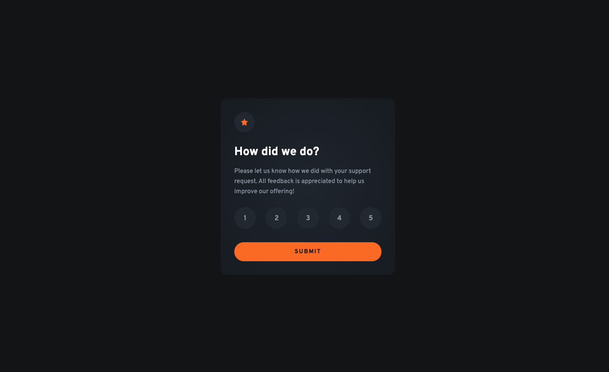

# Frontend Mentor - Interactive rating component solution

This is a solution to the [Interactive rating component challenge on Frontend Mentor](https://www.frontendmentor.io/challenges/interactive-rating-component-koxpeBUmI). Frontend Mentor challenges help you improve your coding skills by building realistic projects.

## Table of contents

- [Overview](#overview)
  - [The challenge](#the-challenge)
  - [Screenshot](#screenshot)
  - [Links](#links)
- [My process](#my-process)
  - [Built with](#built-with)
  - [What I learned](#what-i-learned)
  - [Continued development](#continued-development)
- [Author](#author)

## Overview

### The challenge

Users should be able to:

- View the optimal layout for the app depending on their device's screen size
- See hover states for all interactive elements on the page
- Select and submit a number rating
- See the "Thank you" card state after submitting a rating

### Screenshot

### Links

- Solution URL: [Here](https://www.frontendmentor.io/solutions/semantic-html-sass-and-typescript-jtorlGzLTr)
- Live Site URL: [Here](https://nv-interactive-rating-component.netlify.app/)

## My process

### Built with

- Semantic HTML5 markup
- SASS/SCSS
- Flexbox
- Mobile-first workflow
- TypeScript
- JavaScript

### What I learned

This challenge provided additional utilization of my frontend skills and reinforced my knowledge of common accessibility best practices. I continued to build my 'muscle memory' in developing clean code that matches the desgin file provided. I also implemented TypeScript to further learn the ins and outs.

### Continued development

I look forward to learning more about accessbility best practices and to further build upon my TypeScript skills.

## Author

- Portfolio - [Nate Valline](https://natevalline.dev)
- Frontend Mentor - [@nvalline](https://www.frontendmentor.io/profile/nvalline)
- LinkedIn - [Nate Valline](https://www.linkedin.com/in/nvalline)
